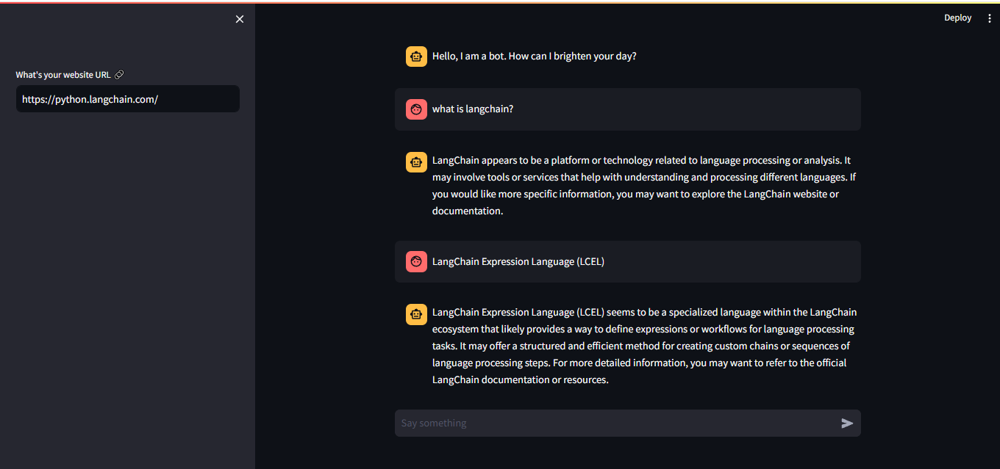

# Webite Assistant

Transform your website into a dynamic and interactive platform with SiteAssistant AI. Built with Python, Streamlit, LangChain, Openai GPT 3.5

## To run this app locally, follow these steps:

- Clone the repository
- `pipenv shell` or which ever virtual environment you are using
- `pipenv install -r requirement.txt`
- `streamlit run app.py`
